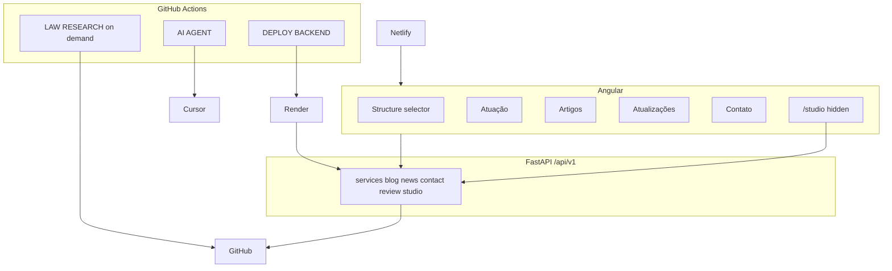

# Architecture

News and articles enter a review queue before they are treated as published copy. The on-demand research action opens an issue labeled `law-research`. A `[POST]` comment publishes one item. The `solve` label is only for code changes.
